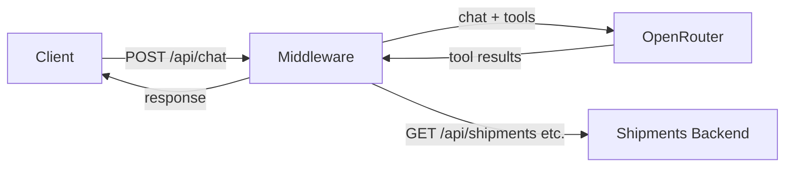

# Shipments MCP

AI middleware server that answers natural-language questions about shipments by calling an existing shipments backend API via OpenRouter (LLM with function-calling). Use it as the chat backend for a frontend or MCP client.

## Architecture

The client sends messages to this server; the server calls OpenRouter with tool definitions. OpenRouter may request data from your shipments backend via tool calls; this server executes those calls and returns results to OpenRouter until the model produces a final text response.



## Prerequisites

- **Node.js** >= 18
- An **OpenRouter API key** (e.g. from [OpenRouter Keys](https://openrouter.ai/keys))
- A running **shipments backend** that exposes the expected API (e.g. `/api/shipments`, `/api/shipment-details`, `/api/reference/*` — see [src/services/backendApi.ts](src/services/backendApi.ts))

## Installation

```bash
git clone <repo-url>
cd shipmentsMCP
npm install
```

## Configuration

1. Copy `.env.example` to `.env`.
2. Set the following variables:

| Variable | Required | Description |
|----------|----------|-------------|
| `OPENROUTER_API_KEY` | Yes | Your OpenRouter API key |
| `BACKEND_API_URL` | Yes | Base URL of the shipments backend (e.g. `http://localhost:3000`) |
| `MODEL` | No | OpenRouter model (e.g. `meta-llama/llama-3.3-70b-instruct:free`, `anthropic/claude-3.5-sonnet`) |
| `PORT` | No | Port for this server (default `3001`) |
| `CHAT_PASSWORD` | Yes | Bearer token for `POST /api/chat` |
| `LOG_LEVEL` | No | `debug`, `info`, `warn`, or `error` (default `info`) |

**Security:** Do not commit `.env` or put real API keys in `.env.example`. Use placeholders in the example and add your own keys in `.env`.

## Running the server

- **Development:** `npm run dev` (tsx watch on `src/index.ts`)
- **Build:** `npm run build` (TypeScript → `dist/`)
- **Production:** `npm start` (runs `dist/index.js`)

The server listens on `http://localhost:<PORT>` (default 3001).

## API reference

### GET /api/health

- No authentication.
- **Response:** `{ "status": "ok" }`

### POST /api/chat

- **Authentication:** `Authorization: Bearer <CHAT_PASSWORD>`
- **Body:** `{ "message": string, "conversationHistory"?: Array<{ role, content }> }` (see [src/types.ts](src/types.ts) `ChatRequest`)
- **Response:** `{ "response": string }` (see `ChatResponse`)
- **Errors:** 400 if `message` is missing or invalid, 401 if auth fails, 500 on OpenRouter or backend errors

## How it works

1. The server sends the user message (and optional conversation history) to OpenRouter with a **system prompt** (shipment assistant) and **tool definitions** from [src/tools/definitions.ts](src/tools/definitions.ts) (list/get shipments, shipment details, reference tables: countries, service codes, statuses, etc.).
2. OpenRouter may return **tool_calls**. The server runs them via [src/tools/executor.ts](src/tools/executor.ts), which calls [src/services/backendApi.ts](src/services/backendApi.ts). Reference lookups (countries, statuses, etc.) are cached in memory.
3. Tool results are sent back to OpenRouter. The loop continues until the model returns a final text response, which is returned as `response` to the client.

## Project structure

| Path | Purpose |
|------|---------|
| `src/index.ts` | Express app, health route, chat router |
| `src/config.ts` | Env validation and config |
| `src/routes/chat.ts` | `POST /api/chat` and Bearer auth |
| `src/services/openrouter.ts` | OpenRouter chat and tool-call loop |
| `src/services/backendApi.ts` | HTTP client for shipments backend |
| `src/tools/definitions.ts` | OpenRouter tool schemas |
| `src/tools/executor.ts` | Map tool name + args to backend calls |
| `src/types.ts` | Chat and OpenRouter message types |
| `src/logger.ts` | Level-based logger |
